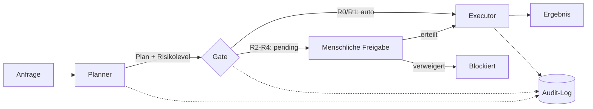

# Mini-Demo: Governance-Gate-Muster

[](https://github.com/Eangelus/catandbob/actions/workflows/ci.yml)

Eigenständige, vollständig neu geschriebene Mini-Implementierung des
Governance-Gate-Musters aus [Cat & Bob](../README.md): Planung und Ausführung
als getrennte Rollen, mit einem Risiko-Gate dazwischen, das ab einer
bestimmten Kritikalität eine menschliche Freigabe erzwingt.

**Kein Auszug aus dem produktiven Code.** Dies ist ein von Grund auf neu
geschriebenes, bewusst kleines Beispiel, das zeigt, wie das Muster
funktioniert — kein Zugriff auf die echte Risikologik, Sandbox oder
Business-Logik. Siehe auch [../DEEP-DIVE.md](../DEEP-DIVE.md) für einen
Architektur-Ausschnitt aus dem echten Tool-Plugin-System.

## Architektur



Jede Stufe schreibt einen Audit-Eintrag — auch eine blockierte Ausführung wird
protokolliert, nicht nur eine erfolgreiche.

## Komponenten

| Modul | Rolle | Verantwortung |
|---|---|---|
| `catbob_mini/risk.py` | Risikoklassifikation | Ordnet ein Aufgabenprofil einem Level R0–R4 zu |
| `catbob_mini/workflow.py` | `Planner` / `Gate` / `Executor` | Planung, Freigabe-Entscheidung, Ausführung |
| `catbob_mini/audit.py` | `AuditLog` | Append-only, unveränderliche Protokollierung jeder Entscheidung |

## Beispiel

```python
from catbob_mini.audit import AuditLog
from catbob_mini.risk import TaskProfile
from catbob_mini.workflow import Executor, Gate, Planner

audit = AuditLog()
planner, gate, executor = Planner(audit), Gate(audit), Executor(audit)

plan = planner.plan("Billing-Logik aendern", TaskProfile(touches_billing=True))
decision = gate.decide(plan)          # -> PENDING_HUMAN, R2 erfordert Freigabe
result = executor.execute(plan, decision)   # -> None, blockiert ohne Freigabe

decision = gate.decide(plan, human_approved=True)
result = executor.execute(plan, decision)   # -> "erledigt: Billing-Logik aendern"

for entry in audit.entries:
    print(entry.timestamp, entry.actor, entry.action, entry.reason)
```

## Tests & CI

```bash
cd demo
pip install pytest ruff
ruff check .
pytest -v
```

17 Tests, Lint + Tests laufen bei jedem Push über GitHub Actions (Badge oben).

## Lizenz

MIT — siehe [LICENSE](LICENSE). Gilt nur für diesen Demo-Code, nicht für Cat & Bob selbst.
